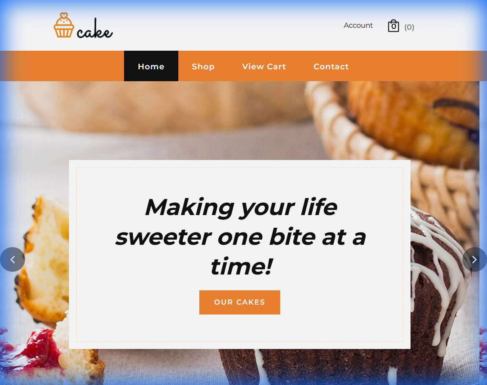
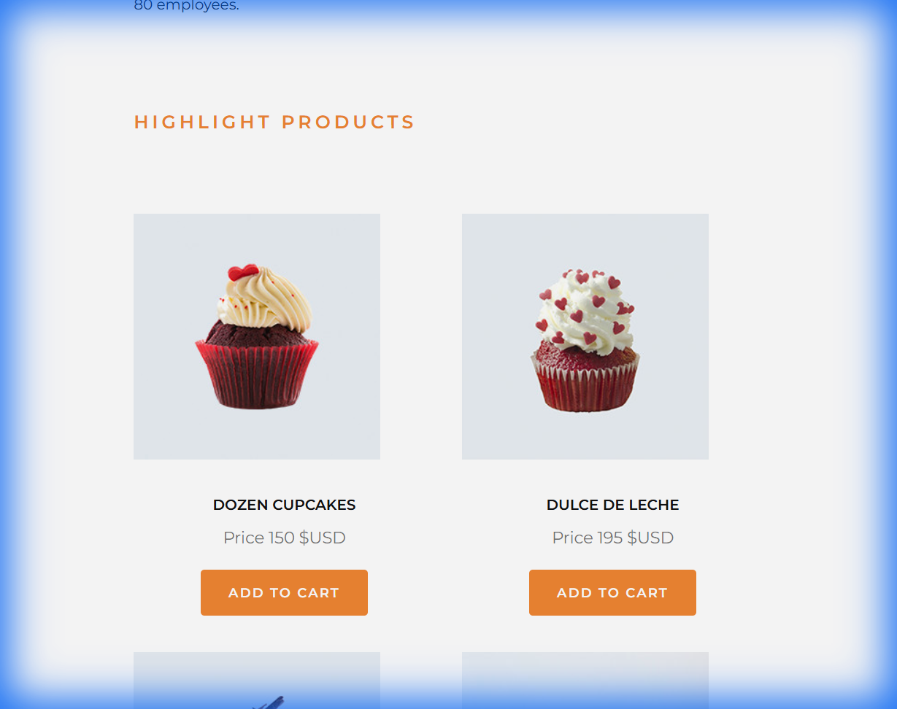
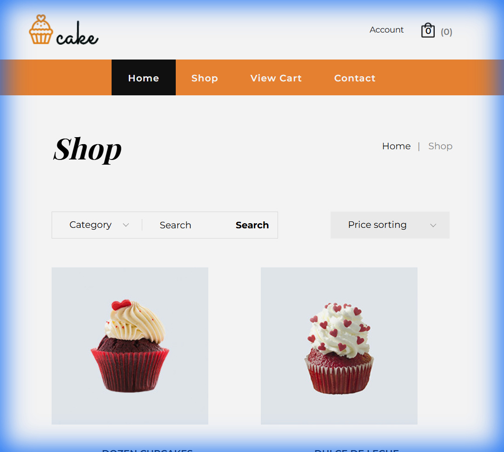
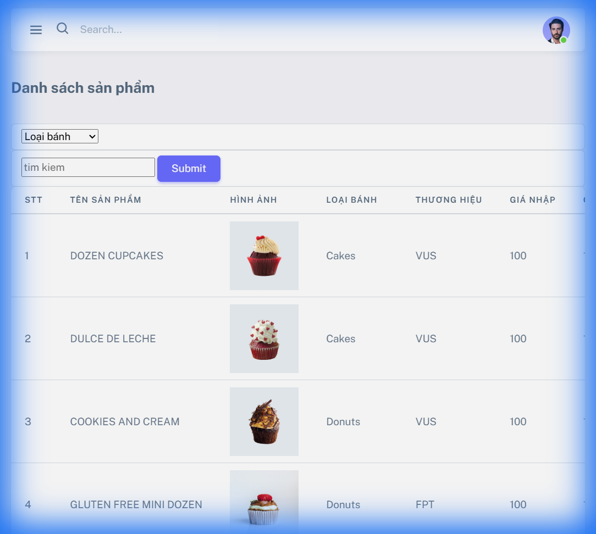
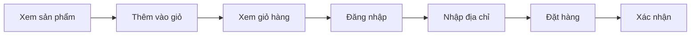
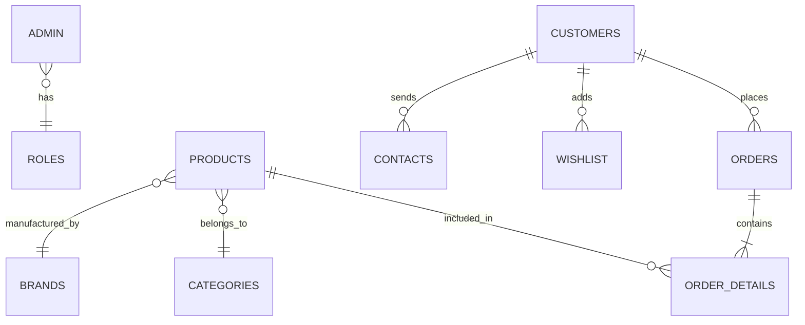

# 🍰 Cake Sale Website

<p align="center">
  
</p>

<p align="center">
  <strong>Website bán bánh trực tuyến với đầy đủ tính năng E-commerce</strong>
</p>

<p align="center">
  
  
  
  
</p>

---

## 📋 Mục lục

- [Giới thiệu](#-giới-thiệu)
- [Demo Screenshots](#-demo-screenshots)
- [Tính năng](#-tính-năng)
- [Công nghệ sử dụng](#️-công-nghệ-sử-dụng)
- [Cấu trúc thư mục](#-cấu-trúc-thư-mục)
- [Cài đặt](#️-cài-đặt)
- [Hướng dẫn sử dụng](#-hướng-dẫn-sử-dụng)
- [API Endpoints](#-api-endpoints)
- [Database Schema](#-database-schema)
- [Kiểm thử](#-kiểm-thử)
- [Troubleshooting](#-troubleshooting)
- [Đóng góp](#-đóng-góp)
- [License](#-license)

---

## 🎯 Giới thiệu

**Cake Sale Website** là một hệ thống thương mại điện tử hoàn chỉnh dành cho cửa hàng bán bánh, được xây dựng bằng PHP thuần và MySQL. Dự án bao gồm:

- 🛒 **Giao diện khách hàng** - Duyệt sản phẩm, đặt hàng, quản lý tài khoản
- 🔧 **Trang quản trị Admin** - Quản lý toàn bộ hoạt động kinh doanh
- 📱 **Responsive Design** - Tương thích mọi thiết bị

---

## 📸 Demo Screenshots

### 🏠 Trang chủ
<p align="center">
  
</p>

### ✨ Sản phẩm nổi bật
<p align="center">
  
</p>

### 🛍️ Trang Shop
<p align="center">
  
</p>

### 🛒 Giỏ hàng
<p align="center">
  
</p>

### 📊 Admin Dashboard
<p align="center">
  
</p>

### 📦 Quản lý sản phẩm
<p align="center">
  
</p>

---

## ✨ Tính năng

### 👤 Dành cho Khách hàng

| Tính năng | Mô tả |
|:----------|:------|
| 🔍 **Tìm kiếm** | Tìm sản phẩm theo tên |
| 📂 **Lọc danh mục** | Lọc theo Cakes, Donuts, Butter Cakes |
| ⬆️⬇️ **Sắp xếp** | Sắp xếp theo giá tăng/giảm |
| 🛒 **Giỏ hàng** | Thêm, sửa số lượng, xóa sản phẩm |
| 💳 **Thanh toán** | Đặt hàng với thông tin giao hàng |
| 👤 **Tài khoản** | Đăng ký, đăng nhập, xem lịch sử |
| 📞 **Liên hệ** | Gửi tin nhắn đến admin |

### 🔧 Dành cho Admin

| Tính năng | Mô tả |
|:----------|:------|
| 📊 **Dashboard** | Thống kê tổng quan |
| 📦 **Sản phẩm** | Thêm, sửa, xóa, ẩn/hiện |
| 📁 **Danh mục** | Quản lý categories |
| 🏷️ **Thương hiệu** | Quản lý brands |
| 📋 **Đơn hàng** | Xem, cập nhật trạng thái |
| 👥 **Khách hàng** | Xem danh sách, quản lý |
| 📨 **Liên hệ** | Xem tin nhắn từ khách |

---

## 🛠️ Công nghệ sử dụng

### Backend
- **PHP 8.0+** - Ngôn ngữ lập trình chính
- **MySQL/MariaDB** - Cơ sở dữ liệu
- **PHPMailer** - Gửi email

### Frontend
- **HTML5 & CSS3** - Cấu trúc và giao diện
- **JavaScript & jQuery** - Tương tác động
- **Bootstrap 5** - Framework CSS
- **Owl Carousel** - Slider
- **Font Awesome** - Icons

### Công cụ
- **XAMPP** - Apache + MySQL + PHP
- **phpMyAdmin** - Quản lý database
- **Git** - Version control

---

## 📁 Cấu trúc thư mục

```
Cake-Sale-Website/
│
├── 📂 admin/                    # Trang quản trị
│   ├── 📂 html/                 # Các trang admin
│   │   ├── index.php            # Dashboard
│   │   ├── product_list.php     # Danh sách sản phẩm
│   │   ├── product_add.php      # Thêm sản phẩm
│   │   ├── category_list.php    # Danh sách danh mục
│   │   ├── order_list.php       # Danh sách đơn hàng
│   │   └── user_list.php        # Danh sách khách hàng
│   └── 📂 uploads/              # Hình ảnh sản phẩm
│
├── 📂 cake-main/                # Trang khách hàng
│   ├── 📂 css/                  # Stylesheets
│   ├── 📂 js/                   # JavaScript files
│   ├── 📂 img/                  # Hình ảnh tĩnh
│   ├── 📂 inc/                  # Header, Footer
│   ├── index.php                # Trang chủ
│   ├── list_product.php         # Trang shop
│   ├── product_detail.php       # Chi tiết sản phẩm
│   ├── view_cart.php            # Giỏ hàng
│   ├── checkout.php             # Thanh toán
│   ├── login.php                # Đăng nhập
│   └── register.php             # Đăng ký
│
├── 📂 classes/                  # PHP Classes (OOP)
│   ├── user_register.php        # Xử lý đăng ký
│   ├── user_login.php           # Xử lý đăng nhập
│   └── admin_login.php          # Admin authentication
│
├── 📂 database/                 # Database files
│   ├── connect.php              # Kết nối MySQL
│   ├── config.php               # Cấu hình DB
│   └── banhang_php.sql          # File SQL import
│
├── 📂 helpers/                  # Helper functions
├── 📂 lib/                      # Thư viện bên ngoài
├── 📂 docs/                     # Tài liệu
│   └── 📂 screenshots/          # Ảnh chụp màn hình
│
└── README.md                    # File này
```

---

## ⚙️ Cài đặt

### 📋 Yêu cầu hệ thống

| Thành phần | Phiên bản |
|:-----------|:----------|
| PHP | 8.0+ |
| MySQL/MariaDB | 5.7+ / 10.4+ |
| Apache | 2.4+ |
| XAMPP | 8.0+ (khuyến nghị) |

### 🚀 Hướng dẫn cài đặt

#### Bước 1: Clone project

```bash
git clone https://github.com/your-username/Cake-Sale-Website.git
cd Cake-Sale-Website
```

#### Bước 2: Khởi động XAMPP

- Mở **XAMPP Control Panel**
- Start **Apache** và **MySQL**

#### Bước 3: Tạo Symbolic Links

> ⚠️ **Quan trọng:** Chạy CMD với quyền **Administrator**

```bash
# Windows
mklink /D "C:\xampp\htdocs\cake-main" "path\to\Cake-Sale-Website\cake-main"
mklink /D "C:\xampp\htdocs\database" "path\to\Cake-Sale-Website\database"
mklink /D "C:\xampp\htdocs\admin" "path\to\Cake-Sale-Website\admin"
mklink /D "C:\xampp\htdocs\classes" "path\to\Cake-Sale-Website\classes"
mklink /D "C:\xampp\htdocs\helpers" "path\to\Cake-Sale-Website\helpers"
mklink /D "C:\xampp\htdocs\lib" "path\to\Cake-Sale-Website\lib"
```

#### Bước 4: Import Database

1. Mở phpMyAdmin: http://localhost/phpmyadmin
2. Click **Import**
3. Chọn file: `database/banhang_php.sql`
4. Click **Go**

#### Bước 5: Cấu hình kết nối (nếu cần)

Sửa file `database/connect.php`:

```php
<?php
$conn = mysqli_connect('localhost', 'root', 'YOUR_PASSWORD', 'banhang_php');
mysqli_set_charset($conn, 'utf8');
?>
```

#### Bước 6: Truy cập website

| Trang | URL |
|:------|:----|
| 🏠 Trang chủ | http://localhost/cake-main/ |
| 🛍️ Shop | http://localhost/cake-main/list_product.php |
| 🔐 Admin | http://localhost/admin/html/ |

---

## � Hướng dẫn sử dụng

### �🔑 Tài khoản mẫu

| Vai trò | Email | Mật khẩu |
|:--------|:------|:---------|
| 👨‍💼 Admin | admin@gmail.com | 1 |
| 👤 Khách hàng | 16.05.01h@gmail.com | 1 |

### 🛒 Quy trình mua hàng



1. **Duyệt sản phẩm** - Xem shop, tìm kiếm, lọc theo danh mục
2. **Thêm vào giỏ** - Click "Add to Cart"
3. **Xem giỏ hàng** - Kiểm tra số lượng, tổng tiền
4. **Đăng nhập** - Đăng nhập hoặc đăng ký tài khoản
5. **Checkout** - Nhập địa chỉ, số điện thoại
6. **Xác nhận** - Hoàn tất đơn hàng

---

## � API Endpoints

### Khách hàng

| Method | Endpoint | Mô tả |
|:-------|:---------|:------|
| GET | `/cake-main/index.php` | Trang chủ |
| GET | `/cake-main/list_product.php` | Danh sách sản phẩm |
| GET | `/cake-main/product_detail.php?id={id}` | Chi tiết sản phẩm |
| GET | `/cake-main/list_product_by_category.php?id={id}` | Lọc theo danh mục |
| GET | `/cake-main/search_product.php?keyword={keyword}` | Tìm kiếm |
| GET | `/cake-main/sort_low_to_high_product.php` | Sắp xếp giá tăng |
| GET | `/cake-main/sort_high_to_low_product.php` | Sắp xếp giá giảm |
| GET | `/cake-main/cart.php?id={id}` | Thêm vào giỏ |
| GET | `/cake-main/view_cart.php` | Xem giỏ hàng |
| POST | `/cake-main/checkout.php` | Thanh toán |
| POST | `/cake-main/login.php` | Đăng nhập |
| POST | `/cake-main/register.php` | Đăng ký |

### Admin

| Method | Endpoint | Mô tả |
|:-------|:---------|:------|
| GET | `/admin/html/index.php` | Dashboard |
| GET | `/admin/html/product_list.php` | Danh sách sản phẩm |
| POST | `/admin/html/product_add.php` | Thêm sản phẩm |
| GET | `/admin/html/product_update.php?id={id}` | Sửa sản phẩm |
| GET | `/admin/html/order_list.php` | Danh sách đơn hàng |
| GET | `/admin/html/order_detail.php?id={id}` | Chi tiết đơn hàng |

---

## 📊 Database Schema

### ERD Diagram



### Bảng dữ liệu

| Bảng | Mô tả | Cột chính |
|:-----|:------|:----------|
| `admin` | Quản trị viên | Id, Username, Email, Password, Role |
| `customers` | Khách hàng | CustomerId, Fullname, Email, Password, Phone, Address |
| `products` | Sản phẩm | ProductId, Name, Image, Quantity, BuyPrice, SellPrice |
| `category` | Danh mục | CategoryId, CategoryName, Status |
| `brands` | Thương hiệu | BrandId, BrandName, Image |
| `oders` | Đơn hàng | OderId, CustomerId, OrderDate, Address, TotalPrice, Status |
| `orderdetails` | Chi tiết đơn | OrderDetailId, OderId, ProductId, Quantity, Price |
| `contacts` | Liên hệ | ContactId, UserName, Email, Message |
| `wishlist` | Yêu thích | WishListId, CustomerId, ProductId |
| `roles` | Phân quyền | RoleId, Name, Description |

---

## 🧪 Kiểm thử

### Kết quả kiểm thử

| Metric | Giá trị |
|:-------|:--------|
| Tổng test cases | 22 |
| Passed | 21 |
| Failed | 0 |
| Partial | 1 |
| **Tỷ lệ thành công** | **95.5%** |

### Chi tiết kiểm thử

| Nhóm | Test Cases | Kết quả |
|:-----|:-----------|:--------|
| 🛒 Shop & Cart | 4 | ✅ 4/4 PASS |
| 🔐 Authentication | 2 | ✅ 2/2 PASS |
| 💳 Checkout | 2 | ✅ 2/2 PASS |
| 🔍 Search/Filter | 4 | ✅ 4/4 PASS |
| 📞 Contact | 1 | ✅ 1/1 PASS |
| 🔧 Admin Panel | 9 | ✅ 9/9 PASS |

---

## ❓ Troubleshooting

### Lỗi thường gặp

<details>
<summary><strong>❌ Fatal error: Class not found</strong></summary>

**Nguyên nhân:** Thiếu symbolic link cho folder `classes`

**Giải pháp:**
```bash
mklink /D "C:\xampp\htdocs\classes" "path\to\Cake-Sale-Website\classes"
```
</details>

<details>
<summary><strong>❌ Access denied for user 'root'</strong></summary>

**Nguyên nhân:** Password MySQL không đúng

**Giải pháp:** Sửa file `database/connect.php`:
```php
$conn = mysqli_connect('localhost', 'root', '', 'banhang_php'); // Password rỗng
```
</details>

<details>
<summary><strong>❌ Field 'Image' doesn't have a default value</strong></summary>

**Nguyên nhân:** Cột Image trong bảng customers thiếu default value

**Giải pháp:**
```sql
ALTER TABLE customers MODIFY Image varchar(255) DEFAULT 'default.png';
```
</details>

<details>
<summary><strong>❌ 404 Not Found</strong></summary>

**Nguyên nhân:** Chưa tạo symbolic links

**Giải pháp:** Tạo đầy đủ 6 symbolic links như hướng dẫn cài đặt
</details>

---

## 🤝 Đóng góp

Mọi đóng góp đều được hoan nghênh! Hãy:

1. Fork project
2. Tạo branch mới (`git checkout -b feature/AmazingFeature`)
3. Commit changes (`git commit -m 'Add some AmazingFeature'`)
4. Push to branch (`git push origin feature/AmazingFeature`)
5. Mở Pull Request

---

## 📝 License

Dự án này được phát triển cho **mục đích học tập** và **báo cáo cuối kỳ môn Kiểm thử phần mềm**.

---

## 👨‍💻 Thông tin

| | |
|:--|:--|
| 📚 **Môn học** | Kiểm thử phần mềm |
| 🏫 **Trường** | Đại học Sài Gòn (SGU) |
| 📅 **Năm học** | 2025-2026 |
| 📁 **Loại** | Báo cáo cuối kỳ |

---

<p align="center">
  Made with ❤️ for learning purposes
</p>

<p align="center">
  ⭐ Nếu thấy hữu ích, hãy cho mình một star nhé! ⭐
</p>
